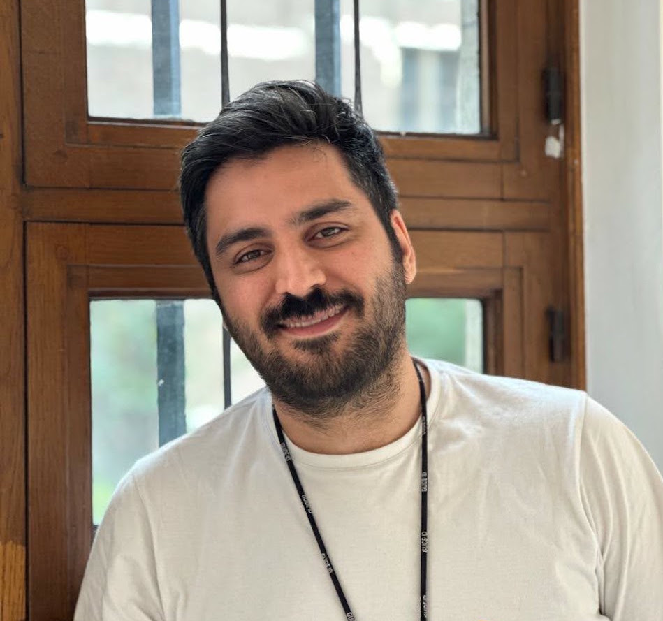
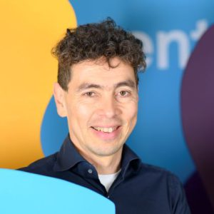
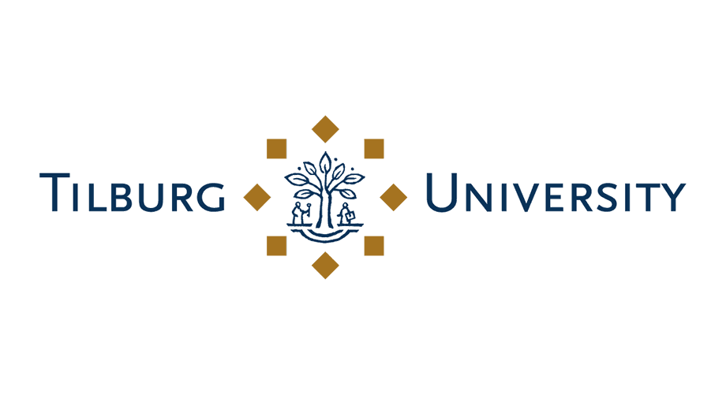
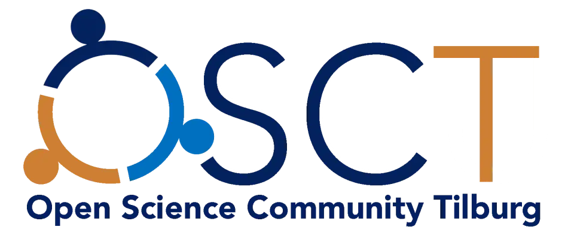
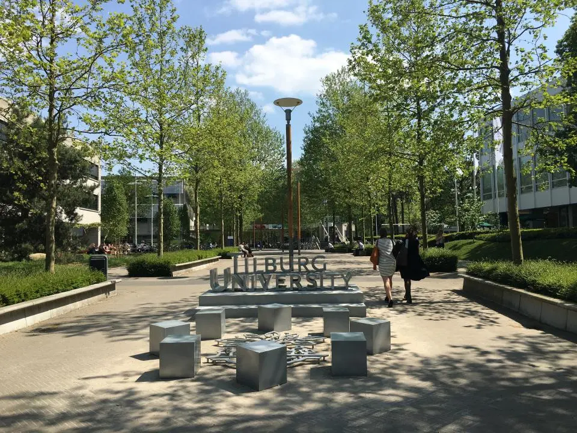

## Instructors

### Rasoul Norouzi

{width="200px" style="border-radius: 50%; float: right; margin-left: 1.5rem; margin-bottom: 1rem;"}

*Department of Methodology and Statistics, Tilburg University*

Rasoul Norouzi is a PhD candidate in social science at Tilburg University. His research uses natural language processing to support theory development and refinement in the social sciences. He works on language models for causal information extraction from scientific text, graph-based methods for analyzing causal claims, and text mining to support transparent and reproducible research synthesis.
He developed SocioCausaNet, the multitask model used in this workshop. He is affiliated with the Insight Lab, the CPCM Lab, and the Meta-Research Lab at Tilburg University. 

Prior to his PhD, Rasoul earned an M.Sc. by Research in Information Technology from Tarbiat Modares University, Tehran.

When he is not training models, he is usually building small tools to make research life a bit less painful, and putting them on GitHub for whoever needs them.

[R.NorouziNikjeh@tilburguniversity.edu](mailto:R.NorouziNikjeh@tilburguniversity.edu)
[rasoulnorouzi.github.io](https://rasoulnorouzi.github.io)
[GitHub](https://github.com/rasoulnorouzi)
[Google Scholar](https://scholar.google.com/citations?user=syJhsDMAAAAJ)
[ORCID 0000-0002-4447-764X](https://orcid.org/0000-0002-4447-764X)

### Erik Tjong Kim Sang

{width="200px" style="border-radius: 50%; float: right; margin-left: 1.5rem; margin-bottom: 1rem;"}

*Senior Research Software Engineer, Netherlands eScience Center*

Erik studied Electrical Engineering at the University of Delft and obtained a PhD in
computational linguistics at the University of Groningen. Next, he worked as a postdoc and
teacher at the universities of Uppsala (Sweden), Antwerp (Belgium), Tilburg, Amsterdam and
Groningen. After a postdoc position at the Meertens Institute in Amsterdam, he joined the
Netherlands eScience Center as a Senior Research Software Engineer in 2017.

Erik has worked on a variety of computational linguistics topics, for example orthographic
modeling, syntactic analysis, semantic analysis, named entity recognition, machine
translation, summarization, question answering, dialect modeling and analysis of social
media text. In his work, he has frequently used machine learning techniques.

He leads the morning session on bulk paper retrieval.

---

## Organized In Collaboration With



### Netherlands eScience Center

The eScience Center is the Dutch national center for the development and
application of research software. They developed the bulk paper download
package used in the morning session of this workshop.

[https://www.esciencecenter.nl](https://www.esciencecenter.nl)

### Open Science Community Tilburg

{width="180px"}

The Open Science Community Tilburg is a network of researchers at Tilburg
University committed to open and reproducible research practices.

[https://www.tilburguniversity.edu/research/open-science-community](https://www.tilburguniversity.edu/research/open-science-community)

### Insight Lab

Insight Lab develops transparent and reproducible methods for social science
research, led by Dr. Caspar van Lissa at Tilburg University.

[https://cjvanlissa.github.io/insight_lab/](https://cjvanlissa.github.io/insight_lab/)

---

## About the Workshop



This workshop was a pre-conference event held on **September 30, 2026** in
Tilburg, Netherlands. It gave social science researchers hands-on practice
with a reproducible text mining pipeline that needs no background in
machine learning.

The full pipeline, from downloading papers to a visual causal knowledge
graph, uses only deterministic, evidence-based models. Every result the
pipeline produces can be traced back to an exact sentence in an exact paper.

---

## Citing This Workshop

If you use materials from this workshop in your own work, please cite:

```
Norouzi, R. (2026). Text Mining Systematic Reviews: A Pre-Conference
Workshop. Tilburg University. https://rasoulnorouzi.github.io/causal-km-workshop
```
